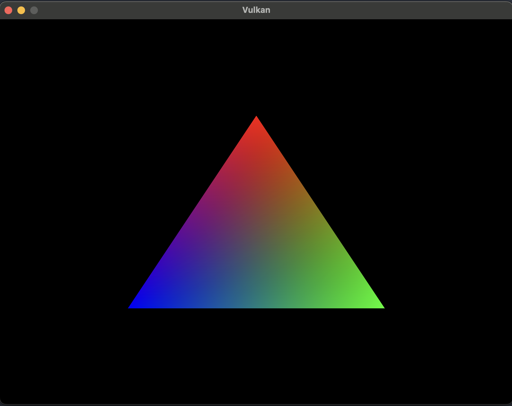

# vulkan experiments

This is a playground to experiment with the vulkan api in zig.
currently it is drawing a triangle.



## running

Easiest ist to spawn the nix shell, which includes all dependencies.

```bash
nix-shell
```

within the shell, run the application

```bash
zig build run
```

or, alternativly, run the application and debug print the vulkan api calls

```bash
VK_INSTANCE_LAYERS=VK_LAYER_LUNARG_api_dump zig build run
```

Alternatively, use `vkconfig` for more fine grained layers config.

More verbose moltenVK logging

```bash
MVK_CONFIG_LOG_LEVEL=2 zig build run
```

## code generations

In order to (re-)generate the c bindings, run

```bash
zig build -Dgenerate-bindings
```

## ressources

- [Vulkan Tutorial](https://vulkan-tutorial.com/)
- [Vulkan youtube series by Codotaku](https://www.youtube.com/watch?v=Kf7BIPUUfsc) with [source code](https://github.com/CodesOtakuYT/vulkan_zig)
- [Vulkan & SDL2 by Codotaku](https://www.youtube.com/playlist?list=PLlKj-4rp1Gz2KfP0B0XN2a5i-WFjhyzrh) with [source](https://github.com/CodesOtakuYT/zig_vk)
- [zig + vulkan + glfw by andrewrk](https://github.com/andrewrk/zig-vulkan-triangle/tree/master)
- [vulkan game engine tutorials by Brendan Galea](https://www.youtube.com/playlist?list=PL8327DO66nu9qYVKLDmdLW_84-yE4auCR) with [source code](https://github.com/blurrypiano/littleVulkanEngine)
